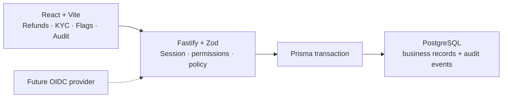

# Fintech demo

Three internal tools share a session, server-side permissions, privileged-action policy, PostgreSQL persistence, and an application audit trail. All identities, customers, and transactions are synthetic.

## Start

Requires [Node.js 20.19+](https://nodejs.org). No Docker or separate PostgreSQL install.

```bash
./demo.sh
```

This installs dependencies, starts local PostgreSQL, migrates and seeds the database, and launches the API and web app. Open <http://localhost:5173>. Use `./demo.sh reset` before a fresh walkthrough; `./demo.sh status` and `./demo.sh down` inspect or stop the database. Ctrl+C stops the app servers.

## Demo flows

1. **Viewer:** Sign in as `viewer`. Open refund `RF-1002` and inspect the transaction. Decision controls are unavailable. Feature flags are read-only; the API also rejects viewer writes.
2. **Analyst:** Switch to `analyst`. Approve `RF-1001` with an optional reason. Open `KYC-2003`, inspect its high-risk synthetic signals, then reject it. Refresh both pages to show the decisions persist.
3. **Admin:** Switch to `admin`. Enable `ops.bulk-actions` in Feature flags, then inspect its stored value and change history. This switch does not activate a real feature.
4. **Audit:** Open Audit and filter by entity type. Check the actor, action, reason, before/after state, and time for all three decisions.

Refund approvals do not move money. KYC does not call a vendor. Repeating a decision returns a conflict without another successful audit event. For a scripted tour, see [docs/demo.md](docs/demo.md).

## Architecture



The API resolves identity from an HTTP-only session cookie. Successful mutations and audit events commit together. The identity picker works in demo mode only; the audit trail is not a compliance store. See [docs/architecture.md](docs/architecture.md) for boundaries and limitations.

## Checks

With the local database running (`npm run db:up`):

```bash
npm run typecheck && npm run lint && npm test && npm run test:e2e && npm run build
```
