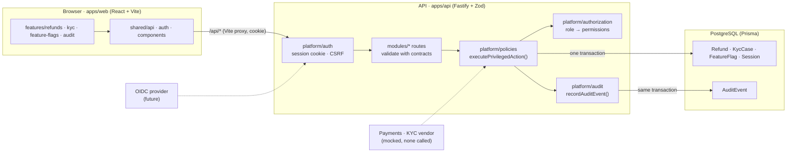

# fintech-demo

Three thin internal tools — **Refunds**, **KYC**, **Feature flags** — on one shared foundation for
identity, authorization, privileged-action policy, and an application audit trail.

Everything is synthetic: fictional data, a labeled **DEMO MODE** identity picker, simulated decisions.
No money moves, no KYC vendor is called, no real customer data. A prototype, not a production system.

## Run the demo

You need [Node.js](https://nodejs.org) 20+ and [Docker Desktop](https://docs.docker.com/get-docker/) running. Then:

```bash
./demo.sh
```

That installs dependencies, creates `.env`, starts PostgreSQL in Docker, applies migrations, loads
seed data, and starts the API (`:3001`) and web app (`:5173`). It tells you exactly what to fix if
Node or Docker is missing, and works around a root-owned `~/.npm` cache without `sudo`.
Open **<http://localhost:5173>** and pick an identity:

| Identity | Role | Can do |
| --- | --- | --- |
| `viewer` | `VIEWER` | read everything |
| `analyst` | `OPS_ANALYST` | viewer + approve / reject refunds and KYC cases |
| `admin` | `ADMIN` | analyst + enable / disable feature flags |

Other demo commands (`./demo.sh <cmd>` or, once installed, `npm run demo -- <cmd>`):

```bash
./demo.sh reset     # drop + recreate the database with fresh seed data
./demo.sh seed      # re-seed only (clears demo decisions and audit events)
./demo.sh status    # is Postgres / API / web up?
./demo.sh down      # stop Postgres (data kept)
./demo.sh help
```

On Windows use WSL or run the steps by hand: `npm install && npm run demo`.

A 60–90 second scripted walkthrough is in [docs/demo.md](docs/demo.md).

## What's in the demo

| App | Features |
| --- | --- |
| **Refunds** | Filter by status, search by reference/customer, inspect the synthetic transaction, approve or reject a `PENDING` request (simulated decision, optional reason). |
| **KYC** | Filter by status and risk level, inspect fictional risk flags, approve or reject a `PENDING` case. |
| **Feature flags** | See every flag's state and last change; admins enable/disable with a confirmation dialog. Non-admin writes get `403` from the API, not just a hidden button. |
| **Audit** | One read-only trail across all three apps: actor + role snapshot, action, entity, timestamp, reason, before/after state. Each record's detail panel shows its own history too. |

Shared behaviour every app gets for free:

- **Server-side identity** — HTTP-only signed session cookie → `Session` row → actor and permissions.
  Actor/role fields in request bodies are ignored. CSRF header + same-origin checks on mutations.
- **One mutation path** — `executePrivilegedAction()`: permission check → shared action policy →
  business change **and** audit event in a single transaction.
- **Safe transitions** — guarded updates (`WHERE status = 'PENDING'`); repeated or competing
  decisions return `409 CONFLICT` and never produce a second audit event.
- **Consistent errors** — `{ error: { code, message, details? } }` with
  `VALIDATION_ERROR | UNAUTHENTICATED | FORBIDDEN | NOT_FOUND | CONFLICT`.
- **Persistence** — PostgreSQL; refresh the browser and everything is still there.

## Architecture



`packages/contracts` holds the Zod schemas shared by API, web, and tests. Details, the request
flow, and where a real OIDC provider plugs in: [docs/architecture.md](docs/architecture.md).

## Develop

```bash
npm run dev          # API + web with reload (same as `npm run demo` without the setup steps)
npm run typecheck    # tsc in every workspace + scripts/
npm run lint         # ESLint, type-aware
npm test             # 24 Vitest API integration tests against fintech_demo_test (real DB, no mocks)
npm run test:e2e     # 3 Playwright browser tests (permitted action, denied role, admin toggle, refresh)
npm run build        # production builds for contracts, API, web
```

`db:*` scripts (`db:up`, `db:migrate`, `db:seed`, `db:reset`, `db:down`) are the building blocks
`npm run demo` uses.

## Mocked and out of scope

- **Identity** — DEMO MODE picker of three seeded users; mounted only when `DEMO_AUTH_ENABLED=true`,
  refused when `NODE_ENV=production`. It cannot create users or roles.
- **Payments / KYC vendors** — not integrated; a refund approval writes a decision row, nothing else.
- **Audit** — an application audit trail, append-only by code path; not tamper-evident or
  compliance-certified. No update/delete endpoints exist.
- **Not built** — pagination, session rotation/MFA/rate limiting, CI workflow. Reason on privileged
  actions is optional by design; making it required is the proposed next iteration
  ([docs/demo.md](docs/demo.md#proposed-second-iteration)).

If Docker Hub rate-limits the `postgres:16-alpine` pull:
`docker pull mirror.gcr.io/library/postgres:16-alpine && docker tag mirror.gcr.io/library/postgres:16-alpine postgres:16-alpine`.
